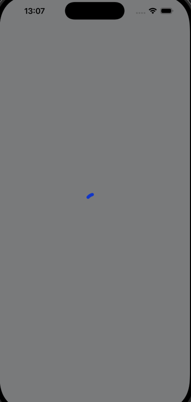

# DHLLoadingAnimation
Custom loading animation view.


## Preview


## Installation

### CocoaPods

```ruby
pod 'DHLLoadingAnimation'
```

## Quick Start

### UIKit

If you have a "custom_lottie.json" on your project. That animation will be used.

```swift
DHLLoadingAnimation.widthMultiplier = 0.5

self.showLoadingAnimation(show: true)

self.showLoadingAnimation(show: false)
```
